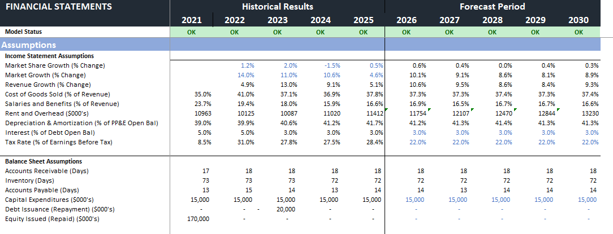
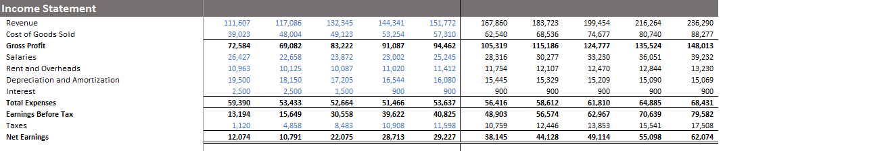
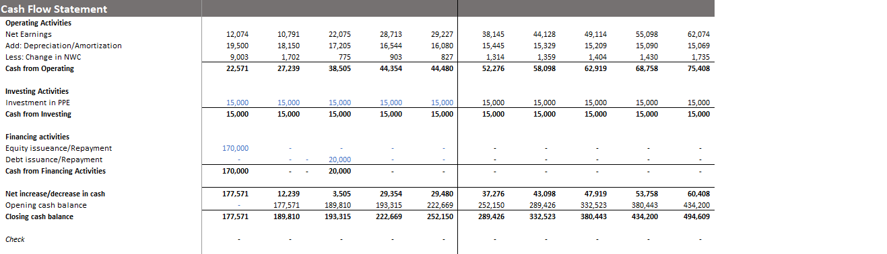
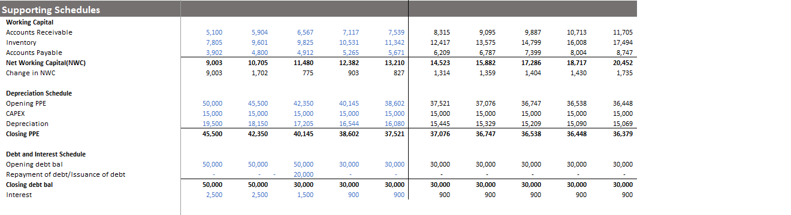

# three-statement-financial-model

# Three-Statement Financial Model

A fully integrated three-statement financial model (Income Statement, Balance Sheet, and Cash Flow Statement) with supporting schedules.

## Model Overview

This model projects financial performance from 2021–2030 and includes:

- Historical results (2021–2025)
- Forecast period (2026–2030)
- Fully linked Income Statement, Balance Sheet, and Cash Flow Statement
- Supporting schedules for Working Capital, Depreciation, and Debt & Interest

## Key Features

- Driver-based assumptions (using historical averages for key metrics)
- Integrated financial statements
- Working Capital schedule (AR, Inventory, AP days)
- Depreciation & Amortization schedule
- Debt and Interest schedule
- Clear separation between historical and forecast periods

## Assumptions Approach

Key drivers (Revenue growth, COGS %, Operating expenses, Working capital days, etc.) were set using historical averages from 2021–2025, with reasonable adjustments for the forecast period.

## Income Statement

## Cash Flow Statement

## Supporting Schedules

Includes:
- Working Capital Schedule
- Depreciation Schedule
- Debt & Interest Schedule

## Tools Used
- Microsoft Excel
